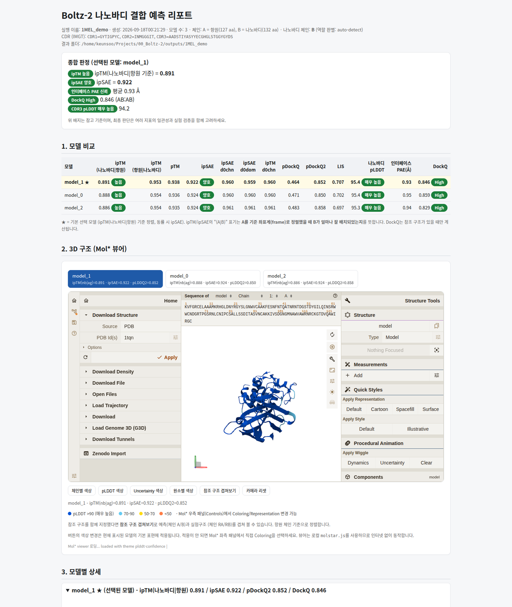
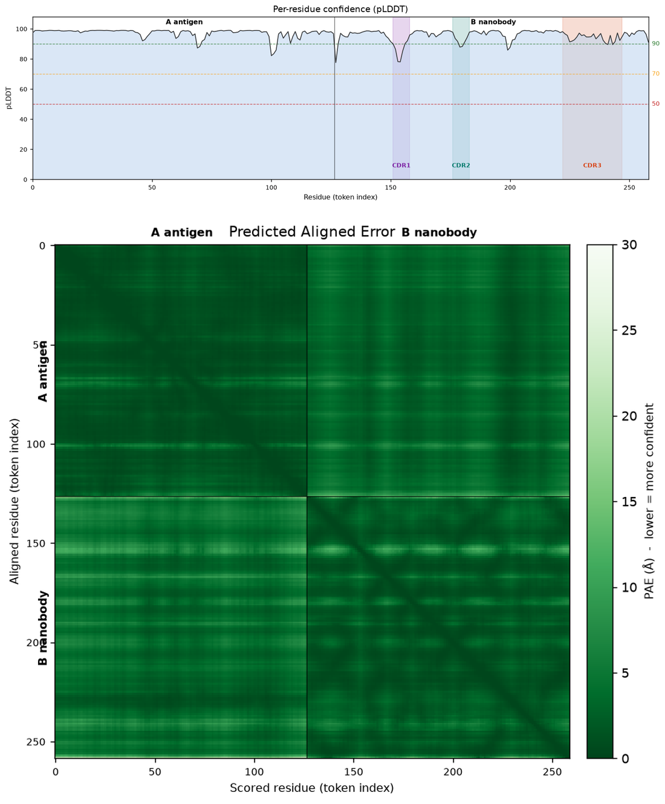

# Boltz-2 nanobody pipeline

나노바디와 항원 서열을 넣으면 복합체 구조를 예측하고, 결과를 HTML 리포트로 만들어 줍니다.
Ubuntu + NVIDIA GPU에서 돌립니다.

**처음이면 이 순서대로**: 1장 설치(`bash setup.sh --verify`) → `./run.sh --doctor` →
3-1장에서 하려는 일에 맞는 시나리오(A~F) **하나만** 따라하기.
막히면 7장(문제가 생기면)을 보고, 그래도 안 되면 서열·명령·오류 메시지 전문과 함께 전달하세요.
공개 PDB 기반 예제는 `examples/`에, 결과의 출처·실행 조건과 해석 기준은
[provenance 안내](docs/PROVENANCE.md)에 있습니다.



리포트에서 볼 수 있는 것: 3D 구조(마우스로 회전), 모델별 점수 비교, PAE 히트맵, 잔기별 pLDDT,
CDR 서열과 CDR별 신뢰도, 인터페이스 잔기 목록, DockQ(정답 구조가 있을 때).

---

## 1. 설치

먼저 이 저장소를 받고 그 폴더로 들어갑니다. git이 없으면 `sudo apt-get install -y git` 로 설치하세요.

```bash
git clone https://github.com/kangk1204/Kang_Boltz2_public.git
cd Kang_Boltz2_public
```

> 이후 모든 명령은 이 저장소 폴더(예: `~/Kang_Boltz2_public`)에서 실행합니다.

conda가 없으면 Miniforge부터 설치합니다.

```bash
curl -L -O https://github.com/conda-forge/miniforge/releases/latest/download/Miniforge3-Linux-x86_64.sh
bash Miniforge3-Linux-x86_64.sh -b -p $HOME/miniforge3
eval "$($HOME/miniforge3/bin/conda shell.bash hook)"
```

그다음 저장소 폴더에서:

```bash
bash setup.sh --verify && ./run.sh --doctor
# 설치 + 실제 예측·분석·리포트 검증이 성공하면 환경 점검까지 실행
```

- 환경·가중치·다운로드 임시 파일을 위해 수십 GB의 여유 공간을 준비하세요. 설치 시간은 네트워크에 따라 달라집니다.
- **필요한 도구는 기본으로 함께 설치됩니다**: matplotlib(그림), ANARCI+HMMER(CDR 주석/변이 생성), DockQ(참조 구조 평가). 굳이 빼려면 `--no-hmmer` / `--no-anarci` / `--no-dockq` 를 붙입니다.
- RTX 5060 Ti에서 실제 예측을 검증했습니다. 사용하는 GPU·드라이버는 `nvidia-smi`와 `--doctor`, `--verify`로 확인하세요.
- boltz가 이미 깔린 서버라면 `BOLTZ_ENV=/path/to/env ./run.sh ...`로 그 환경을 씁니다.
- **기존 환경이 있어도 같은 설치 명령을 사용합니다.** `boltz2`가 있으면 `boltz2_2`, 그 이름도 있으면 `boltz2_3`처럼 비어 있는 이름을 자동 선택합니다. 기존 환경은 보존하고 새 환경에 Python 3.12와 필요한 패키지를 설치합니다.
- 설치·검증이 성공하면 새 환경 경로를 저장소의 `.boltz_env`에 기록합니다. 이후 `./run.sh --doctor`와 예측 명령은 **방금 설치한 환경을 자동 사용**하므로 별도 conda 활성화나 경로 지정이 필요 없습니다. 단, 직접 설정한 `BOLTZ_ENV`가 있으면 그 값이 우선하므로 자동 선택을 쓰려면 `unset BOLTZ_ENV` 하세요.
- conda 환경은 저장소 밖에 있으므로 폴더를 지우거나 다시 clone 해도 남습니다. 기본 설치 명령을 다시 실행하면 새 이름으로 설치하며, 기존 환경을 의도적으로 갱신하려면 `ENV_NAME=boltz2_2 bash setup.sh --reuse-env --verify`처럼 설치 완료 메시지의 이름을 지정하세요. 기본 이름을 바꾸려면 `ENV_NAME=boltz2_new bash setup.sh --verify`를 쓰면 됩니다.
- 기본 설치는 Boltz 2.2.1과 PyTorch 2.7.0+cu128을 사용하며, 설치 결과는 환경 폴더의 `boltz2_install_provenance.json`에 남습니다.
- GPU 커널(cuequivariance)은 torch 버전과 맞을 때만 켜집니다. 맞지 않으면(예: 기본 torch 2.7.0+cu128) 예측이 자동으로 `--no-kernels`로 실행되며, **결과는 유효하고 속도만 느려집니다**. 켜려면 torch/cuequivariance 호환 조합이 필요합니다(`TORCH_VERSION`, `TORCH_INDEX_URL`).

---

## 2. 입력

`inputs/` 폴더에 파일 두 개를 넣으면 됩니다.

| 파일 | 내용 | 체인 |
|---|---|---|
| `inputs/target.fasta` | 항원 서열 | A |
| `inputs/nanobody.fasta` | 나노바디(VHH) 서열 1개 | B |

```
>lysozyme
KVFGRCELAAAMKRHGLDNYRGYSLGNWVCAAKFESNFNTQATNRNTDGSTDYGILQINSRW...
```

- 서열 줄바꿈은 아무렇게나 해도 됩니다.
- 항원이 두 체인이면 FASTA에 레코드를 하나 더 넣으세요 (체인 C로 들어갑니다).
- 지금 들어 있는 건 예제(라이소자임 + cAb-Lys3)입니다. 지우고 본인 서열을 넣으면 됩니다.
- 항원의 epitope을 알고 있으면 `--hotspot 45,67,101`처럼 **입력 FASTA의 1-based 위치**를 줄 수 있습니다. PDB/auth/UniProt 번호와 다를 수 있으므로 construct의 태그·절단·결측을 먼저 대조하세요.

---

## 2-1. 참조 구조(reference)란? — 처음이면 꼭 읽기

`--reference`는 **“내가 예측하려는 그 복합체의 정답(실험) 구조”** 입니다. 있으면 예측이 정답과
얼마나 가까운지(**DockQ**)를 계산하고, 3D 뷰어에서 예측과 실험 구조를 겹쳐 볼 수 있습니다.

> **가장 흔한 오해:** 어떤 `.cif` 하나를 “글로벌 레퍼런스”처럼 모든 예측에 재사용할 수 있다? → **아닙니다.**
> 참조는 **그 복합체 전용**입니다. 예제의 `examples/demo_reference_1MEL_AB.cif`는 1MEL
> (라이소자임 + cAb-Lys3) **딱 그 복합체**의 실험 구조라서, **다른** 나노바디/항원에 주면 DockQ가
> 무의미해지거나(서로 다른 분자를 억지로 겹침) 서열 불일치로 실패합니다.

**언제 필요한가**

| 상황 | 해야 할 일 |
|---|---|
| 정답 구조가 PDB에 있음 (내 복합체와 같은 분자) | 그 구조를 받아 `--reference`로 지정 |
| 정답 구조가 없음 / 모름 | `--reference`를 **빼면 됩니다.** DockQ만 빠지고 ipTM·ipSAE·pDockQ2·pLDDT 등은 그대로 나옴 |
| 예제 A/B/E/F 그대로 | 저장소 동봉 `.cif` 사용 (구할 필요 없음) |

**어디서 구하나 (본인 복합체)**

1. PDB에서 검색: `https://www.rcsb.org/` 에서 항원·나노바디 이름이나 PDB ID로 찾기.
2. 구조 페이지(`https://www.rcsb.org/structure/<PDBID>`) 오른쪽 위 **Download Files** →
   - **PDBx/mmCIF Format** → `.cif`  ← **권장**
   - **Legacy PDB Format** → `.pdb`
3. 받은 파일을 `--reference path/to/xxxx.cif` (또는 `.pdb`) 로 지정.

**`.pdb`도 되나?** → **됩니다.** `.cif`(mmCIF)와 `.pdb`(legacy) 둘 다 지원합니다(gemmi·DockQ가 둘 다 읽음).
가능하면 `.cif`를 권장하지만, `.pdb`밖에 없거나 익숙하면 그대로 쓰세요. 동작·DockQ 계산은 동일합니다.

**전처리가 필요한가?** → **대부분 그냥 쓰면 됩니다. 별도 편집은 보통 필요 없습니다.** 다만 DockQ가
서열을 맞춰야 하므로 아래 경우만 확인하세요.

- **체인 이름/구성**: 참조의 항원·나노바디 체인 이름이 내 모델(A/B)과 다를 수 있습니다. 자동 매핑이
  실패하면 `--dockq-mapping AB:HL` 처럼 **모델 체인:참조 체인** 순으로 지정합니다
  (예: 모델 A·B ↔ 참조 H·L).
- **서열이 조금 다름**(태그, 결측 잔기, CDR 변이체): DockQ가 `identical corresponding chain` 으로
  실패하면 실제 서열 차이를 확인한 뒤 `--dockq-mismatches 5`처럼 허용 불일치 수를 명시합니다.
  기본값은 0이며 자동으로 늘려 재시도하지 않습니다. 변이 라이브러리도 필요한 허용 범위를
  직접 지정하고 결과의 체인 매핑을 확인하세요.
- **불필요한 것 제거는 선택**: 물·리간드·다른 사슬이 섞여 있어도 DockQ는 단백질 체인만 매핑하므로
  보통 문제되지 않습니다. 굳이 정리하려면 `.cif`/`.pdb`에서 해당 줄을 지우거나 PDB의
  “Biological Assembly” 대신 **비대칭 단위(asymmetric unit)** 파일을 받으세요.
- **헤테로 원자·수소·번호 재정렬 같은 복잡한 편집은 불필요**합니다. PyMOL/gemmi로 손댈 필요 없이
  받은 파일 그대로 넣는 것이 원칙입니다.

> 정리: **참조는 “그 복합체의 정답 구조” 1개**, `.cif`/`.pdb` 둘 다 가능, 별도 전처리 불필요(체인 매핑·
> 서열 불일치만 옵션으로 보정). 참조가 없어도 예측·리포트는 정상 동작합니다.

---

## 3. 실행

```bash
./run.sh --name first_run
./run.sh --serve outputs/first_run/report   # 브라우저로 열기 (Ctrl+C로 종료)
./run.sh --list                             # 지금까지 돌린 것 목록
```

원격 Ubuntu 서버에서는 위 `--serve`를 실행한 뒤, **본인 PC의 터미널**에서
`ssh -L 8765:127.0.0.1:8765 사용자@서버`를 실행하고 브라우저로 `http://127.0.0.1:8765`를 엽니다.
서버는 기본적으로 loopback에만 바인딩합니다.

끝나면 터미널에 점수 요약이 찍힙니다. 예:

```
  best model_0: ipTM(nb|ag)=0.891 ipSAE=0.922 pDockQ2=0.850 ifacePAE=0.93 DockQ=0.846
```

완료하면 터미널에 리포트 경로가 **클릭 가능한 링크**로 표시됩니다(OSC 8 지원 터미널:
GNOME Terminal, iTerm2, VS Code 터미널 등). 터미널이 지원하지 않거나 로그로 남길 때는
`file://…/report/index.html` URL 텍스트로 출력됩니다. 원격 서버에서는 `./run.sh --serve …`를
쓰고 SSH 포트 포워딩으로 여세요(아래).

---

## 3-1. 시나리오별 따라하기

하려는 일에 맞는 시나리오 **하나만** 따라 하면 됩니다.
공통: 명령은 저장소 폴더에서 실행하고, 첫 설치는 1장(`bash setup.sh --verify`).
예제 입력은 **`examples/scenarios/`** 에 준비되어 있어(잘 알려진 PDB 1MEL·1VFB + 참조 구조) 아래 명령을
그대로 복사해 바로 실행할 수 있습니다. 전체 목록은 `examples/scenarios/README.md`.

**한눈에 보기**

| 하고 싶은 것 | 시나리오 | 필요한 입력 |
|---|---|---|
| 나노바디 + 항원 복합체 예측 | **A** | FASTA 2개 |
| 항체(Fv: VH+VL) + 항원 복합체 예측 | **B** | YAML 1개 |
| 항원만 구조 예측 (binder 없음) | **C** | FASTA 1개(여러 레코드 가능) |
| 후보 여러 개 한꺼번에 비교 | **D** | TSV 1개 |
| 나노바디 CDR 변이 만들기 | **E** | FASTA 1개 |
| 항체 VH/VL CDR 변이 만들기 | **F** | FASTA 1~2개 |

---

### 시나리오 A. 나노바디–항원 복합체

**준비** — FASTA 두 개(대문자 아미노산, 나노바디는 레코드 1개).
- `inputs/target.fasta` : 항원 → 체인 A
- `inputs/nanobody.fasta` : 나노바디(VHH) → 체인 B

지금 들어 있는 건 예제(라이소자임 + cAb-Lys3)입니다. 파일을 바꾸거나 경로를 지정하세요.

**실행** — 예제 입력이 `examples/scenarios/A_nanobody/` 에 준비되어 있습니다.
```bash
./run.sh --target examples/scenarios/A_nanobody/target.fasta \
         --nanobody examples/scenarios/A_nanobody/nanobody.fasta \
         --reference examples/demo_reference_1MEL_AB.cif \
         --name scn_A
# 기본 inputs/ 를 그대로 쓰려면
./run.sh --name nb01
```

**자동 분석** — 체인 B를 VHH로 인식 → CDR 3개(IMGT), 나노바디|항원 ipTM·ipSAE·PAE,
참조가 있으면 DockQ/CAPRI. 자동 판별이 애매하면 `--nanobody-chain B --antigen-chain A`로 명시.
> `--reference examples/demo_reference_1MEL_AB.cif`는 **저장소에 동봉**된 파일이라 따로 구할 필요가 없습니다.
> 본인 복합체의 참조 구조를 구하는 방법은 **2-1장 “참조 구조(reference)란?”** 을 보세요.

**결과** — `outputs/scn_A/report/index.html` (기본 inputs/ 로 돌린 경우 `outputs/nb01/…`).
`analysis/results.json`, `analysis/figures/` 포함. 터미널에도 입력·출력 경로가 그대로 찍힙니다.

**해석** — ipTM/ipSAE 높고 인터페이스 PAE 낮으면 상대 배치를 확신. CDR3 pLDDT 낮으면 루프가 불확실.
모두 **구조 예측 신뢰도**이며 결합력(Kd)이 아닙니다.

---

### 시나리오 B. 항체(Fv, VH+VL)–항원 복합체

**준비** — 항체는 VH+VL 두 체인이라 `nanobody.fasta`(1개) 규약에 맞지 않습니다.
YAML로 항원·VH·VL을 각각 넣습니다. 예제는 `examples/scenarios/B_fv/fv.yaml`
(항원=lysozyme, VH/VL=D1.3, PDB 1VFB)입니다.
```yaml
# fv.yaml
version: 1
sequences:
  - protein: {id: A, sequence: <항원 서열>}   # 항원
  - protein: {id: B, sequence: <VH 서열>}    # 가변 중쇄
  - protein: {id: C, sequence: <VL 서열>}    # 가변 경쇄
```

**실행** — B를 binder로, 항원 집합을 A로 **명시**합니다(참조 구조로 DockQ까지).
```bash
./run.sh --yaml examples/scenarios/B_fv/fv.yaml --name scn_B \
  --nanobody-chain B --antigen-chain A --antigen-chains A \
  --reference examples/scenarios/B_fv/reference_D1.3_lysozyme.cif \
  --msa-subsample 512
```
> `--antigen-chains A`를 빼면 **VL(C)이 항원으로 섞여** VH–VL 계면이 항원 인터페이스에 들어갑니다. 꼭 붙이세요.
> 참조 구조(`reference_D1.3_lysozyme.cif`)도 **저장소에 동봉**되어 있어 따로 구하지 않아도 됩니다.
> `--msa-subsample 512`는 16GB GPU용 메모리 절약 설정입니다. MSA에서 모델에 사용하는 행 수를
> 줄이며, 예측 모델 수(기본 3개)는 유지합니다. 전체 MSA를 사용하는 기본 실행과 결과가 달라질 수 있습니다.

**자동 분석** — binder = VH(B) 기준입니다. VH CDR 3개, VH–항원 인터페이스(ipTM·ipSAE·PAE), 참조가 있으면 DockQ.
VL(C)은 3D 구조에만 표시(`other`)되고 **VL CDR/파라토프·VH–VL 계면은 지표에 없습니다**(현재 한계).

**결과** — `outputs/scn_B/report/index.html` (나노바디 모드와 동일 구조).
> 참고: 예제 B(D1.3–lysozyme)는 기존 전체 MSA 기본 실행에서 항원 인터페이스 ipTM이 낮게(≈0.29) 나왔습니다.
> Fv 자체는 잘 접히지만(VH–VL ipTM≈0.96) 이 인터페이스는 모델이 확신하지 못한 결과입니다(참조가
> 있어 DockQ로 정량 확인 가능). 안정적으로 잘 맞는 대조 사례는 나노바디 예제 A(1MEL)입니다.

**해석** — **VH–항원 인터페이스** 중심으로 보세요. VL 기여는 Mol* 3D 뷰어에서 눈으로 확인하고,
정량 평가가 필요하면 VL 포함 분석 확장이 필요합니다.

---

### 시나리오 C. 항원만 예측 (binder 없음, target-only)

**준비** — 항원 FASTA 1개(복합체면 레코드를 여러 개; A, C, D… 로 들어감).

**실행**
```bash
./run.sh --target examples/scenarios/C_target_only/target.fasta --target-only --name scn_C
```

**자동 분석** — CDR/파라토프 분석은 자동으로 빠지고 pTM·pLDDT·체인별 지표 중심입니다.
인터페이스 ipTM 같은 binder 지표는 **0이 아니라 "해당 없음(None)"** 으로 표시됩니다.

**결과/해석** — `outputs/scn_C/report/index.html`. 항원 단독 구조/복합체 조립 신뢰도를 봅니다.

---

### 시나리오 D. 후보 여러 개 한꺼번에 (배치)

**준비** — TSV 한 개. 아래는 **형식 예시**(가상 이름)이며, 그대로 실행할 파일은
`examples/scenarios/D_batch/batch.tsv` 입니다.
```
name        antigen               nanobody                  reference     hotspot   notes
nb01        inputs/target.fasta   inputs/nanobody.fasta     ref.cif       -         야생형
nb02        inputs/target.fasta   mutants/m2.fasta          -             45,67     CDR2 변이
nb03        inputs/RBD.fasta      QVQLVESGGG...             -             -         서열 직접 입력
```
- `antigen`/`nanobody` 칸은 **FASTA 경로 또는 서열 문자열**(공백 없는 20 aa 이상).
- 항원이 여러 체인이면 `;` 로 구분. 참조가 없으면 `-`.
- job 이름은 `[A-Za-z0-9._-]` 이고 중복되면 안 됩니다.

**실행** (예제: `examples/scenarios/D_batch/batch.tsv`)
```bash
./run.sh --batch examples/scenarios/D_batch/batch.tsv --name scn_D
./run.sh --batch examples/scenarios/D_batch/batch.tsv --name scn_D --concurrency 2
./run.sh --batch examples/scenarios/D_batch/batch.tsv --name scn_D --jobs scnD_m2   # 일부만
```

**자동 분석/결과** — job별 개별 리포트 + **정렬·검색·행 클릭 3D 표 리포트**.
같은 그룹에 야생형(`*_WT` 또는 `m0:`)이 있고 입력·실행·분석 조건이 맞으면 ΔipSAE/ΔipTM을 계산합니다.
- `outputs/batch_scn_D/report/index.html` (표), `report/summary.tsv`, 개별 `<job>/report/index.html`, 로그 `_logs/<job>.log`.
- Δ를 못 쓰는 job은 그 사유가 리포트 카드와 `summary.tsv`의 `delta_reason` 열에 남습니다.

**해석** — 후보 **순위화**용입니다. Δ는 조건이 일치할 때만 신뢰하고, 실패한 job은 로그를 본 뒤
`--jobs <job>`으로 재실행하세요. 일부 job이 실패하면 종료 코드가 0이 아니지만 리포트는 만들어집니다.

---

### 시나리오 E. CDR 변이 — 나노바디

**준비** — 나노바디 FASTA 1개. ANARCI가 CDR을 자동으로 잡고 Cys는 보존합니다.
예제 입력: `examples/scenarios/E_cdr_nanobody/nanobody.fasta`.

> `--reference`(정답 구조)의 의미와 구하는 법은 **2-1장 “참조 구조(reference)란?”** 을 보세요.
> 예제 E는 `examples/demo_reference_1MEL_AB.cif`가 저장소에 동봉되어 있어 따로 구할 필요가 없습니다.

**실행** (예제 입력으로 바로; 예제 `.cif`가 이미 있으므로 경로만 지정)
```bash
./run.sh --make-cdr-library \
  --nanobody examples/scenarios/E_cdr_nanobody/nanobody.fasta \
  --target examples/scenarios/A_nanobody/target.fasta \
  --reference examples/demo_reference_1MEL_AB.cif \
  --cdrs CDR3 --n-mutations 1-3 --n-variants 5 --seed 42 \
  --prefix scnE --outdir examples/scenarios/E_cdr_nanobody/library \
  --batch-out examples/scenarios/E_cdr_nanobody/cdr_library.tsv
```
→ `.../library/`의 변이 FASTA들 + `cdr_library.tsv`(야생형 대조 + 변이 5).
(경로를 생략하면 `inputs/nanobody.fasta`+`inputs/target.fasta` → `examples/cdr_library/`+`cdr_library.tsv`)

**평가**
```bash
SAMPLES=1 ./run.sh --batch examples/scenarios/E_cdr_nanobody/cdr_library.tsv --name scn_E
```

**파라토프(인터페이스) 잔기만 변이** (야생형을 먼저 돌린 뒤)
```bash
./run.sh --make-cdr-library \
  --paratope-from outputs/scn_A --paratope-min-contacts 3 \
  --cdrs CDR3 --n-mutations 1-2 --n-variants 5
```

**결과/해석** — `outputs/batch_scn_E/report/index.html`. 점수 하락은 **구조 예측상
인터페이스/루프 신뢰도 하락**이지 실제 결합력 손실이 아닙니다. WT와 변이는 construct·MSA 정책·
sample 수·seed·모델 선택 기준을 맞춰야 비교가 성립합니다.

---

### 시나리오 F. CDR 변이 — 항체 (VH만 / VL만 / 둘 다)

**꼭 알아둘 규칙 3가지**
1. 변이 라이브러리는 **한 번에 한 사슬**만 만듭니다(FASTA 1개). H와 L을 동시에 랜덤하지 않습니다.
2. 어떤 CDR을 변이할지는 `--cdrs` 로 고릅니다: `--cdrs CDR3`(CDR3만), `--cdrs CDR1,CDR2,CDR3`(전부).
3. **H·L을 같은 접두어로 만들면 이름이 충돌**합니다(파일·배치 job 중복 → 실행 거부).
   `--prefix` 와 `--outdir`/`--batch-out` 를 H/L로 **나누세요**. 항원(`--target`)은 같은 파일을 써도 됩니다.

**VH만 (예: CDR3만)** — 예제 입력 `examples/scenarios/F_cdr_antibody/vh.fasta` (D1.3 VH)
```bash
./run.sh --make-cdr-library \
  --nanobody examples/scenarios/F_cdr_antibody/vh.fasta \
  --target examples/scenarios/B_fv/target.fasta \
  --cdrs CDR3 --n-mutations 1-3 --n-variants 5 --seed 42 \
  --prefix D13_H --outdir examples/scenarios/F_cdr_antibody/lib_H \
  --batch-out examples/scenarios/F_cdr_antibody/cdr_H.tsv
```

**VL만 (예: CDR1,2,3 전부)** — 예제 입력 `examples/scenarios/F_cdr_antibody/vl.fasta` (D1.3 VL)
```bash
./run.sh --make-cdr-library \
  --nanobody examples/scenarios/F_cdr_antibody/vl.fasta \
  --target examples/scenarios/B_fv/target.fasta \
  --cdrs CDR1,CDR2,CDR3 --n-mutations 1-3 --n-variants 5 --seed 42 \
  --prefix D13_L --outdir examples/scenarios/F_cdr_antibody/lib_L \
  --batch-out examples/scenarios/F_cdr_antibody/cdr_L.tsv
```

**둘 다 만들기** — 위 두 명령을 각각 실행하면 됩니다(접두어 `D13_H`/`D13_L`, 출력 폴더 `lib_H`/`lib_L` 이라 안 겹침).

**평가 방법** — 위 명령이 만든 TSV 는 각각 `examples/scenarios/F_cdr_antibody/cdr_H.tsv`, `.../cdr_L.tsv` 입니다.
- VH 변이: `SAMPLES=1 ./run.sh --batch examples/scenarios/F_cdr_antibody/cdr_H.tsv --name cdr_H`
- VL 변이(또는 둘 다): 이 배치는 **단일 binder(chain B)** 전제라 Fv 전체를 바로 평가하지 못합니다.
  변이 서열을 Fv YAML의 해당 체인(VH 또는 VL)에 넣고 `--yaml` 로 실행하세요(시나리오 B 참고).

**접두어가 자동으로 겹치는 경우** — 두 FASTA 헤더의 첫 토큰이 같으면 기본 접두어도 같아집니다.
그때는 `--prefix Ab_H` / `--prefix Ab_L` 처럼 반드시 다르게 지정하세요.

**한계** — H·L **조합**(예: H CDR3 × L CDR3 동시 변이)은 현재 자동 생성되지 않습니다.
필요하면 두 라이브러리를 조합해 별도 TSV/YAML을 만드세요.

---

## 4. 출력

```
outputs/<이름>/
├── boltz_results_<이름>/predictions/    예측 구조(cif), 신뢰도(json), PAE(npz)
├── analysis/
│   ├── results.json                     리포트에 들어가는 모든 숫자
│   ├── figures/*.png                    PAE/pLDDT/ipSAE 그림
│   └── overlay/*.cif                    예측+실험구조 겹친 파일 (참조 구조를 줬을 때)
└── report/index.html                    브라우저로 여는 파일
```

리포트 위쪽에는 Mol* 3D 뷰어가 있습니다. 구조를 돌려 보면서
`체인별 색상`, `pLDDT 색상` 버튼으로 색을 바꿀 수 있고,
정답 구조를 `--reference`로 준 경우 `참조 구조 겹쳐보기` 버튼이 나옵니다(예측 A/B, 실험구조 RA/RB).



위 그림은 리포트에 자동으로 들어가는 잔기별 pLDDT(위)와 PAE 히트맵(아래)입니다.
PAE 히트맵은 가로·세로가 잔기 번호이고, 검은 줄은 체인 경계입니다. 나노바디–항원 블록이
PAE가 낮을수록 모델이 상대 위치를 더 확신한다는 뜻입니다. 실제 결합이나 정답 pose의 증거와는 구분합니다.

---

## 5. 지표 읽는 법

| 지표 | 무슨 뜻인가 | 해석 |
|---|---|---|
| pLDDT | 잔기별 국소 구조 신뢰도 (0-100) | 높은 값은 높은 모델 확신도. 낮은 값만으로 무질서를 확정하지 않음 |
| PAE | 한 잔기를 기준으로 정렬했을 때 다른 잔기의 예상 위치 오차 (Å) | 낮을수록 상대 위치에 대한 모델 확신이 높음 |
| pTM | 전체 구조의 신뢰도 추정 (0-1) | 높은 값이 실험적 정확도를 보장하지 않음 |
| ipTM | 체인 간 상대 배치 신뢰도 (0-1) | 같은 점수 정의·construct·계산 조건에서 비교 |
| ipSAE | 낮은 PAE 잔기 쌍을 이용한 인터페이스 점수 (0-1) | cutoff와 score source를 함께 확인 |
| pDockQ / pDockQ2 | 인터페이스 품질 추정 점수 | 보정 자료와 적용 범위가 있는 추정량이며 결합력 값이 아님 |
| DockQ | 실험 구조(정답)와 비교한 도킹 정확도 | 0.80 위 High, 0.49-0.80 Medium, 0.23 미만 Incorrect |
| CDR pLDDT | CDR 루프(특히 CDR3)의 국소 신뢰도 | CDR3가 낮으면 파라토프 모양을 믿기 어려움 |

읽는 순서는 이렇게 하는 걸 권합니다.

1. **대표 점수의 범위** — 단일 항원 체인은 Boltz 방향별 ipTM, 다중 항원 체인은 전체 항원 집합의 PAE 기반 ipTM을 사용합니다. 다중 체인 ipSAE도 항원 집합으로 계산하며, 두 정의를 동일한 점수처럼 섞어 비교하지 않습니다.
2. **ipTM과 ipSAE** — 5m13은 ipTM 0.923, ipSAE 0.866이어도 DockQ 0.008입니다. 두 신뢰도 지표가 함께 높아도 pose가 틀릴 수 있습니다.
3. **인터페이스 PAE와 접촉** — 평균뿐 아니라 분포, 체인별 접촉, 예상 epitope과의 일치를 확인합니다.
4. **CDR3 pLDDT** — 낮으면 모델이 그 루프를 확신하지 못한다는 뜻입니다. 결합 여부와
   동일시하지 말고, 인터페이스 점수와 함께 해석하세요.
5. **모델 여러 개** — 모델·seed 사이 pose와 epitope의 일관성 및 변동을 확인합니다. 반복 예측은 생물학적 반복 실험이 아니며 특정 sample 수가 충분하다고 검증된 것은 아닙니다.

배치의 대표 모델은 구조 미리보기용입니다. WT 대비 Δ는 각 job의 **전체 모델 평균 차이**이며,
요약 TSV와 상세 화면에 모델 수·평균·표준편차·최솟값·최댓값을 함께 기록합니다. 결측 모델이
섞인 지표의 Δ는 계산하지 않습니다. 한 모델만 있으면 기술적 차이만 제시하며 분산·신뢰구간이나
생물학적 유의성을 추정하지 않습니다. 여러 모델의 변동도 예측 sample 간 변동이며 실험 반복의
불확실성이 아닙니다. epitope recovery, pose consensus, affinity calibration, specificity·ROC/PR은
이 리포트에서 검증된 성능으로 제공하지 않습니다.

주의할 점:

- 기본 FASTA 경로에는 glycan·금속·보조인자·막 환경·pH를 명시하지 않습니다. 고급 Boltz YAML의 기능 지원과 이 파이프라인의 분석 지원은 다릅니다.
- 고급 YAML의 리간드·핵산·PTM은 분석 범위 밖입니다. 해당 입력이 선언되거나 모델 간 잔기 순서/정체성이 다르면 인덱스 기반 PAE·CDR 분석을 생략하고 이유를 표시합니다. 입력 YAML이 없는 과거 결과에는 이 스키마 검증을 소급 적용할 수 없습니다.
- 화면의 색 구간은 탐색용입니다. `ipSAE > 0.6`, `PAE < 5 Å` 등을 범용 합격 기준으로 사용하지 마세요.
- 이 도구는 후보 순위를 정하는 용도입니다. 결합 여부는 SPR/BLI나 구조 실험으로 확인하세요.

---

## 6. 자주 쓰는 옵션

| 옵션 | 설명 | 기본값 |
|---|---|---|
| `--name` | 실행 이름 (결과 폴더 이름) | 타임스탬프 |
| `--samples N` | diffusion sample 수. 많을수록 후보가 다양해짐 | 3 |
| `--seed N` | 랜덤 시드 | 42 |
| `--steps N` / `--recycles N` | 정확도-속도 조절 | 200 / 3 |
| `--reference FILE` | 정답 복합체 구조 (DockQ 계산 + 겹쳐보기) | 없음 |
| `--dockq-mismatches N` | CDR 변이체처럼 참조와 서열이 다를 때 허용할 불일치 수 | 0 |
| `--hotspot 45,67` | 항원 epitope 잔기 지정 | 없음 |
| `--nanobody-chain B` | binder(나노바디) 체인 명시 (자동 판별 실패 시) | 자동 |
| `--antigen-chain A` | 대표 항원 체인 명시 (방향별 ipTM 기준) | 자동 |
| `--antigen-chains A,D` | 항원 체인 **집합** 명시 (Fv 의 VL 등 다른 사슬을 항원에서 제외) | 자동(비-binder 전체) |
| `--target-only` | 나노바디 없이 항원(들)만 예측 (타겟 단독/복합체) | off |
| `--msa server\|empty\|cache` | MSA 방식. `cache`는 서열별로 저장해 재사용 | server |
| `--concurrency N` | 배치에서 동시에 돌릴 job 수 | 1 |
| `--gpus 0,1` | 배치를 GPU별로 나눠 실행 | 없음 |
| `--devices N` | 한 job에 쓸 GPU 수 | 1 |
| `--gpu N` | 사용할 GPU 번호 | 0 |
| `--parallel-samples N` | 동시에 접는 샘플 수 (VRAM 절약) | 1 |
| `--no-kernels` | cuequivariance 커널 없이 실행 (호환 안 되면 자동 적용) | auto |
| `--make-cdr-library` | CDR 변이 라이브러리 + 배치용 TSV 생성 (ANARCI; env 자동 사용) | - |
| `--report-only DIR` | 저장된 분석 조건을 복원해 지표·그림·리포트 재생성 | - |
| `--batch-report DIR` | 배치 표만 다시 | - |
| `--serve DIR` | 웹서버로 리포트 열기 | 포트 8765 |
| `--list` / `--doctor` | 실행 목록 / 환경 점검 | - |

배치가 일부 job이라도 실패하면 마지막에 **비정상 종료 코드**를 돌려줍니다(리포트·`summary.tsv`는
그대로 생성). 스크립트 파이프라인에서 성공/실패를 자동 판정할 수 있습니다. `--jobs` 로 일부만
돌린 경우 진행 표시의 총계는 **선택한 job 수**이고, `summary.tsv` 에는 job별로 Δ 비교 제외
사유가 `delta_reason` 열로 기록됩니다. `--force` 없이 같은 입력·파라미터로 이미 끝난 job은 건너뜁니다.
예측 재사용 판정(`.run_fingerprint`, `.run_params.json`)에는 Python·Boltz·Torch 버전과
Boltz 실행 파일 SHA-256, 실제 커널 모드가 포함됩니다 — 런타임이 바뀌면 자동으로 다시 예측합니다.

배치 manifest는 원본 항원/나노바디 FASTA, reference, 생성 YAML/metadata의 내용 해시를 확인합니다.
같은 경로의 내용이 바뀌거나 파일이 없어지면 기존 manifest를 재사용하지 않습니다. 지정한 reference가
없으면 오류로 종료합니다. `.completed`는 reference 내용, DockQ 옵션, 체인 역할, 분석 의존성/코드와
보고서 코드까지 확인합니다. 분석·보고서만 바뀐 경우에는 검증된 예측 캐시를 재사용할 수 있습니다.
과거 완료 마커는 새 기준을 충족하지 않으므로 처음 한 번 분석·보고서를 다시 생성합니다.

Δ는 위 실행조건뿐 아니라 `parallel_samples`, `devices`, runtime 및 분석 소스/의존성 기록이
일치할 때만 제공합니다. 기록이 빠진 과거 결과는 `delta_reason`에 제외 이유를 남깁니다.
과거 실행에 현재 runtime 정보를 채워 넣어 비교 가능하다고 만들지 않습니다.
DockQ의 서열 불일치 수는 자동으로 완화하지 않습니다. 다른 construct를 평가하려면
사용자가 `--dockq-mismatches N`으로 허용 범위를 명시하고 결과의 매핑을 확인해야 합니다.

MSA 서버는 공용이라 느리거나 가끔 실패합니다. 배치는 실패하면 한 번 자동으로 다시 시도합니다.
`server`와 캐시 최초 생성은 공용 ColabFold 서버에 서열을 제출합니다. 외부 제출이 허용된 서열인지 확인하세요.
`cache`는 체인별 독립 MSA를 재사용하며 **체인 사이 paired MSA 행을 만들지 않습니다**.
따라서 `server`의 다중 체인 pairing과 동일한 입력을 보장하는 속도 옵션은 아닙니다.
WT/변이 비교에서 정책을 맞추고 결과의 실행 기록을 확인하세요. `empty`는 MSA를 생략합니다.

---

## 7. 문제가 생기면

| 증상 | 해결 |
|---|---|
| CUDA out of memory / ran out of memory, skipping batch | `--msa-subsample 512 --parallel-samples 1`. 여전히 부족하면 256으로 낮추고 `nvidia-smi`로 다른 GPU 작업 확인 |
| 실행 중 `Segmentation fault (core dumped)` | 첫 실행에서 흔한 CUDA/드라이버 일시 크래시. 파이프라인이 부분 산출물을 지우고 **자동 재시도**하며 대개 성공합니다. 반복되면 `--no-kernels`, GPU 드라이버·다른 프로세스 확인, 같은 서버의 다른 env(`BOLTZ_ENV=/path/to/env ./run.sh ...`) 시도 |
| 커널 관련 오류 | `--no-kernels` 붙이기 (자동 감지도 됩니다) |
| MSA 서버 시간 초과 | 배치는 자동 재시도. 급하면 `--msa empty` (품질은 낮아짐) |
| CDR 표가 비어 있음 | 선택 환경의 ANARCI·HMMER 설치와 항체 번호 매김 성공 여부 확인 |
| DockQ가 `-` | 참조 구조·체인 매핑·허용 불일치 수와 선택 환경의 DockQ 설치 확인 |
| 3D 뷰어가 안 뜸 | 최신 Chrome/Firefox로 `./run.sh --serve <리포트 폴더>` |
| 리포트가 안 바뀜 | `./run.sh --report-only outputs/<이름>` |
| 배치 일부 실패 (종료 코드≠0) | 정상 동작입니다. `_logs/<job>.log` 확인 후 `--jobs <job>`으로 재실행 |
| Mol* 자산 SHA-256 불일치 | 다운로드가 손상/변조된 경우입니다. `assets/molstar.js`·`assets/molstar.css`를 지우고 `setup.sh` 재실행 |
| ligand 포함 입력 | 리간드·핵산 등 비단백질 토큰이 있으면 PAE 기반 지표(ipSAE, 인터페이스)는 자동 생략되고 confidence JSON 값과 DockQ만 표시됩니다 |

GPU OOM이 감지되면 **한 번만** MSA subsampling 512행과 `parallel_samples=1`로 재시도합니다.
이미 더 작은 MSA 제한을 지정했다면 그 제한을 유지하며, 같은 설정의 OOM을 반복하지 않습니다.
요청한 모델 수·seed·steps·recycles는 유지합니다. 설정 자동 변경을 막으려면 `--no-oom-retry`를 붙이세요.
MSA subsampling은 Boltz의 `--subsample_msa --num_subsampled_msa` 옵션을 사용합니다.
([Boltz 2.2.1 구현](https://github.com/jwohlwend/boltz/blob/v2.2.1/src/boltz/main.py))

실제 설정은 `outputs/<이름>/.run_params.json`과 분석 JSON의 `settings.run_params`에 기록합니다.
`msa_subsample`은 적용 값(0=전체 MSA), `requested_msa_subsample`은 요청 값,
`oom_retry_applied`는 OOM 복구 설정 적용 여부입니다. WT와 변이의 MSA subsampling 설정이 다르면
동일 조건 비교가 아니므로 배치 Δ를 계산하지 않습니다. 같은 값으로 맞추어 다시 예측하세요.
배치 완료 캐시도 실제 설정을 기준으로 구분하므로, MSA 512 복구 결과를 전체 MSA 결과로 재사용하지 않습니다.
각 시도의 원본 로그는 실행 폴더의 `prediction_attempt_1.log`, `prediction_attempt_2.log`에 남습니다.

실패 후 `nvidia-smi`의 메모리가 작게 보일 수 있습니다. Boltz 종료 후 메모리가 반환되므로
그 값은 실패 직전의 최대 사용량이 아닙니다. GPU 연산 사용률(`GPU-Util`)과 메모리 사용량도 별개입니다.

---

## 8. 공개 복합체로 확인한 결과

현재 지정된 코호트는 **9개 WT 복합체와 180개 변이**입니다. 아래 표는 WT 9개에 대해
저장된 대표 모델을 실험 구조와 비교한 결과입니다. 입력·결과 해시는
[코호트 snapshot](examples/testset/cohort_snapshot_2026-09-19.json)에 기록했습니다.

| PDB | 항원 | ipTM | ipSAE | DockQ | CAPRI |
|---|---|---|---|---|---|
| 6her | 프리온 단백질 | 0.969 | 0.951 | 0.890 | High |
| 4n9o | 프리온 β-sheet | 0.962 | 0.939 | 0.984 | High |
| 8qf4 | Arc N-lobe | 0.937 | 0.917 | 0.868 | High |
| 5m13 | MBP | 0.923 | 0.866 | 0.008 | Incorrect |
| 5imm | mouse Vsig4 | 0.873 | 0.767 | 0.927 | High |
| 5imk | human Vsig4 | 0.861 | 0.639 | 0.745 | Medium |
| 9ho5 | frataxin | 0.757 | 0.605 | 0.254 | Acceptable |
| 6xzu | complement C-term | 0.720 | 0.366 | 0.321 | Acceptable |
| 7oao | SARS-CoV-2 RBD | 0.432 | 0.011 | 0.012 | Incorrect |

- 9개 평균: ipTM 0.826095, ipSAE 0.673403, DockQ 0.556461. ipTM 0.8 이상은 6개.
- 역사적 8emz 결과까지 포함한 10개 평균은 0.779 / 0.606 / 0.503입니다. 8emz는 현재 manifest 밖이며 무효 판정을 내린 것은 아닙니다.
- 7oao는 낮은 신뢰도 사례입니다. 5m13은
  ipTM 0.923으로 확신 있게 틀린(paradoxical) 사례, 9ho5·6xzu는 경계선입니다.
- 8qf4는 2026-09-19 교정 전에는 항원 대신 나노바디 서열을 입력해 DockQ 0.056이었으나,
  올바른 Arc 서열로 재예측 후 DockQ 0.868(High)이 되었습니다(`docs/PROVENANCE.md` 4절).
- 여기 DockQ는 **인터페이스별 평균**(DockQ v2의 `GlobalDockQ`/나노바디-항원 인터페이스 평균)입니다.
  합계(`best_dockq`)는 인터페이스 수에 비례하므로 대표값으로 쓰지 않습니다.
- 입력 서열은 PDB 엔티티(SEQRES) 서열을 사용합니다. 즉 모델에 보이지 않는 잔기까지 포함한
  "실제 발현 construct" 기준이라, 참조 구조에 없는 잔기가 많으면 DockQ가 낮게 나올 수 있습니다.
- 저장 결과의 코드 버전·실행 마커·테스트셋 서열 정책 이력은 `docs/PROVENANCE.md` 를 참고하세요.
- WT는 3 samples, 변이는 1 sample이며 변이 180개의 DockQ와 WT 대비 Δ는 계산되지 않았습니다. 변이 친화도 검증 자료가 아닙니다.
- 실험 비결합 대조군이 없어 specificity·PPV·ROC/PR을 평가할 수 없으며, 학습자료와 비중복도 확인하지 않았습니다. 180개 변이는 9개 표적군 안에 속합니다.

공식 범위: [Boltz 예측 안내](https://github.com/jwohlwend/boltz/blob/v2.2.1/docs/prediction.md),
[NVIDIA GPU 사양](https://developer.nvidia.com/cuda/gpus), [PyTorch Blackwell 지원](https://pytorch.org/blog/pytorch-2-7/).

## 9. 구성과 인용

| 구성 | 출처 |
|---|---|
| 구조 예측 | Boltz-2 (Passaro et al., 2025) |
| ipSAE 구현 | Dunbrack lab (MIT, `scripts/vendor/ipsae_official.py`로 포함) |
| pDockQ | Bryant, Pozzati & Elofsson (2022) |
| pDockQ2 | Zhu, Shenoy, Kundrotas & Elofsson (2023) |
| LIS | Kim, Hu, Comjean, Rodiger, Mohr & Perrimon (2024 preprint) |
| DockQ | Mirabello & Wallner, DockQ v2, 2024 |
| 3D 뷰어 | Mol* (Sehnal et al., 2021), v5.11.0 포함 |
| CDR 번호 | ANARCI (IMGT) |
| MSA | ColabFold MMseqs2 서버 |

```
run.sh                          전체 실행
setup.sh                        설치
scripts/prepare_input.py        FASTA -> Boltz YAML
scripts/prepare_batch.py        배치 표 -> YAML 여러 개
scripts/make_cdr_library.py     CDR 변이 라이브러리
scripts/msa_cache.py            서열별 MSA 캐시
scripts/analyze.py              지표 계산
scripts/metrics.py              지표/인터페이스/CDR 계산
scripts/figures.py              그림 생성
scripts/make_report.py          단일 리포트
scripts/batch_report.py         배치 리포트
scripts/fetch_nanobody_complexes.py  PDB 테스트셋 자동 구성
scripts/selftest.py             자체 점검
scripts/runtime_state.py        실행 이름·예측 산출물 검증 런타임
scripts/export_testset_snapshot.py  코호트 snapshot 내보내기
```

### 테스트 (개발·검증용)

개발·검증용이며 일반 사용자는 건너뛰어도 됩니다. `conda` 가 없어도 되도록 설치된 env 의
Python 을 직접 씁니다(`.boltz_env` 는 setup.sh 가 기록한 env 경로).

```bash
ENVPY="$([ -f .boltz_env ] && cat .boltz_env || echo "$HOME/miniforge3/envs/boltz2")/bin/python"
"$ENVPY" -m pip install -r requirements/dev.txt   # pytest 설치
"$ENVPY" -m pytest tests/ -q                      # 계약/런타임 테스트
"$ENVPY" scripts/selftest.py                      # 수학·파싱·렌더 자체 점검
"$ENVPY" scripts/selftest.py --run-dir outputs/<이름>   # 저장 결과 일관성
```

`selftest.py`는 `-O`/`-OO` 또는 `PYTHONOPTIMIZE`가 켜져 있으면 검증을 생략하지 않고 오류로 종료합니다.
기본 Python에 `gemmi` 등이 없으면 위 `ENVPY`로 실행하세요.

`--run-dir` 검사는 기본 계산 설정(200 steps) 결과를 기준으로 하며, `setup.sh --verify`의
짧은 smoke(20 steps, empty MSA)에는 엄격한 ipTM 교차검증을 적용하지 않습니다.
